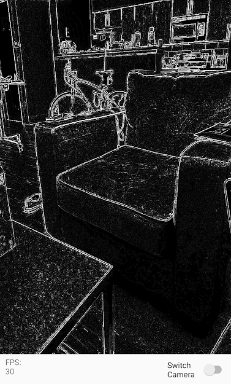

# AndroidOpenCVCamera

A boilerplate camera app for processing camera preview frames in real-time using the **OpenCV Android SDK** and the **native OpenCV C++ library**.

This is intended to give developers a simple way to prototype real-time image processing techniques on a smartphone.  
The application is set up to perform image processing using native code for best performance.

As an example, this application uses **OpenCV** to get the Laplacian (or Canny edges) of each preview frame.

---

## 📷 Screenshot

---

## ✨ Features
- Modifies preview frames from **Camera2 API** using **OpenCV (C++)**
- Real-time image processing via **JNI + NDK**
- Ability to swap between front and back cameras
- Displays **FPS counter** in app
- Tested with **OpenCV 3.4.2**
- Modular structure: `/app`, `/jni`, `/gl`, `/web`

---

## ⚙️ Setup Instructions

**Step 1** – Download the OpenCV Android SDK  
**Step 2** – Import the OpenCV Android SDK as a module in this project  
**Step 3** – Modify the OpenCV module’s `build.gradle`  
**Step 4** – Copy native libs from OpenCV Android SDK  
**Step 5** – Modify the `CMakeLists.txt` file path to point to your project

Example:

Change /Users/jonathanreynolds/Documents/Projects/AndroidOpenCVCamera to be the path to the project, and change /Users/jonathanreynolds/Documents/Projects/OpenCV-android-sdk to be the path to your OpenCV Android SDK folder.

Note:
